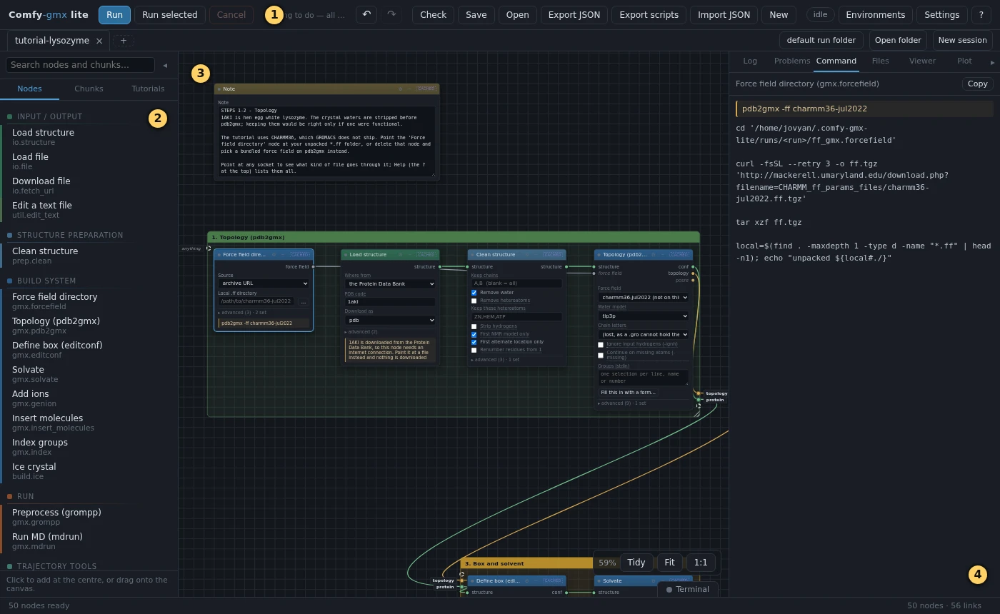

# Before you start

Everything in the tutorials comes down to five things, done again and again:
add a block, wire it to another, change a setting, run, and look at what
came out. This page shows each of them once.

## The screen

[{ .canvas }](pictures/basics/screen.webp)

1. **The toolbar.** **Run** runs every block that has not run yet, or has
   changed since it last ran. **Check** says what is missing before you
   run. **Save**, **Open**, **Export JSON** and **Import JSON** keep the
   whole canvas of blocks and wires, which the editor calls a *graph*, and
   bring it back later. (A chart of numbers is a *plot*, as in the
   **Preview plot** block.) **New** empties the canvas, after asking first.
   **?** opens the help and the tour.
2. **The list of blocks.** **Nodes** has every kind of block, sorted by what
   it does (*node* is the editor's word for a block). **Chunks** has
   ready-made groups of blocks. **Tutorials** has the two tutorials. Typing
   in the search box at the top of the list finds a block by its name.
3. **The canvas**, where the blocks and wires go.
4. **The panel on the right.** Click a block: **Log** shows what it printed
   while it ran, and **Command** shows the exact command it runs. **Files**
   lists the files of the last run, under the name of the block that wrote
   them. **Problems** lists what **Check** found. A block marked **cached**
   did not run this time, because neither its settings nor its inputs
   changed: its Log is empty, but its files are still there.

**◂** and **▸** put either side panel away, so the canvas gets the whole
width. A slim tab stays at the edge of the screen; click it to bring the
panel back.

## Add a block

Click its name in the list on the left: the block appears in the middle of
the canvas. Or drag the name to where you want the block.

If a block on the canvas is selected when you click a name, the new block
goes next to it instead, already wired to it wherever the colours of their
dots match (the next section says what the colours mean). That is a quick
way to build a chain: click a block, then the next one.

To move a block, drag it by its coloured title bar. To remove it, click it
and press ++delete++. ++ctrl+z++ undoes a mistake (on a Mac, ++cmd+z++).

## Wire two blocks

A block takes its files in through the dots on its **left** edge and hands
its results out through the dots on its **right** edge. Each dot's colour is
the kind of file it carries: green for a structure, gold for a topology,
blue for a run file, red for a trajectory, and so on. Point at a dot to see
its name.

Drag from a dot on the right of one block to a dot of the **same colour** on
the left of another. To take a wire away again, double-click the dot it goes
into.

In the tutorial pages, the wires into each block are listed in a table, with
dots in these colours:

| from | its dot | into this block's dot |
| --- | --- | --- |
| ① **Ice crystal** |  ice |  structure |

reads: draw a wire from the dot called *ice* on the right of block ①, *Ice
crystal*, to the dot called *structure* on the left of the block being
described.

## Change a setting

Each block shows its settings as boxes to type in or lists to choose from. A
fresh block already has sensible values; the tutorial pages list only the
ones to change, with the value a fresh block has beside the new one.

The less used settings are folded away in a drawer called **advanced**, at
the bottom of the block. Click it to open it. Some blocks have smaller
drawers inside it, each with a heading: the pages name the heading when a
setting is in one.

## Draw a box around blocks

The tutorials keep each step in a box of its own, with its number and name
on top. A box only keeps the canvas tidy: the blocks work the same without
one. To make one, first select the blocks: start on an empty spot of the
canvas and drag a frame around them, or click them one by one with
++shift++ held. Then press ++ctrl+g++. Right-click the box's title bar and
choose **Rename…** to give it a name. The editor's menus call a box a
*group*.

## Run, and look

Press **Run** at the top left. Each block glows blue while it works, and
gets a green border when it is done. A block whose settings and inputs have
not changed since its last run is not run again: it is marked **cached** and
its stored result is used.

Pictures, plots and movies appear inside the blocks that draw them. Most of
these blocks are listed under **View** in the list of blocks. Drag a picture
of a molecule to turn it, and roll the mouse wheel over it to zoom (on a
touchpad, slide two fingers up or down). The arrow button on a plot opens
it full size in the **Plot** tab.

## When something is missing

Press **Check**. It lists every block that cannot run yet in the
**Problems** tab on the right. Each of those blocks also says on itself what
is wrong, most often an input with no wire into it. Click a line in
**Problems** to jump to its block.

If a block stops with an error, click it and read the end of its **Log**:
GROMACS says there what it did not like.
