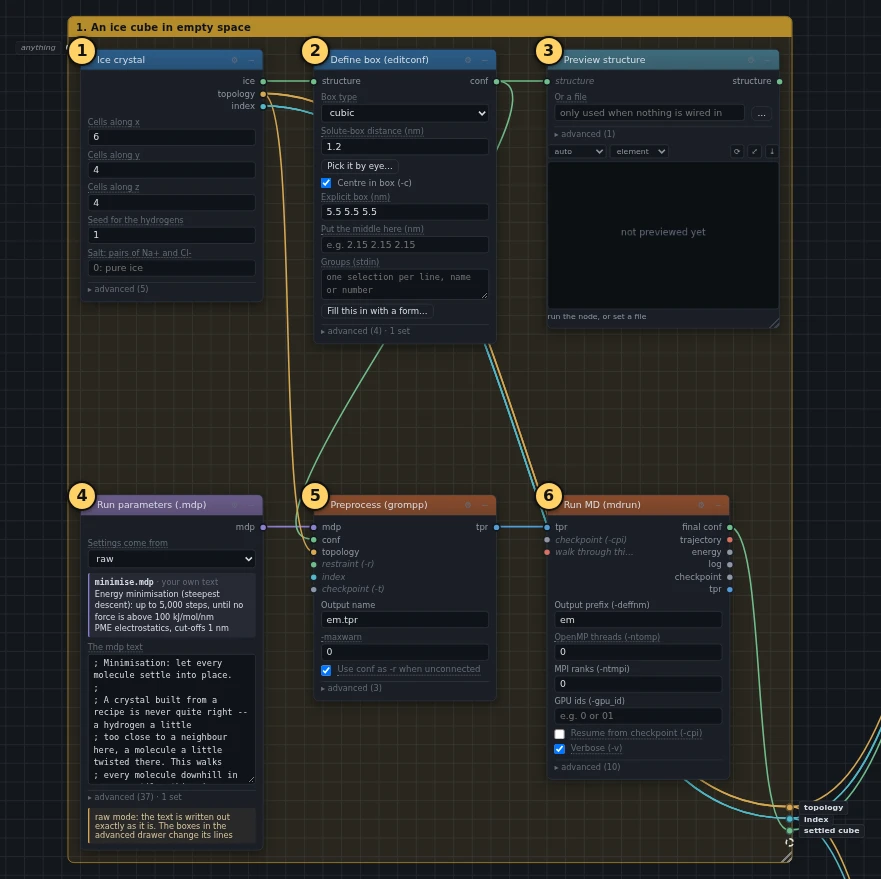
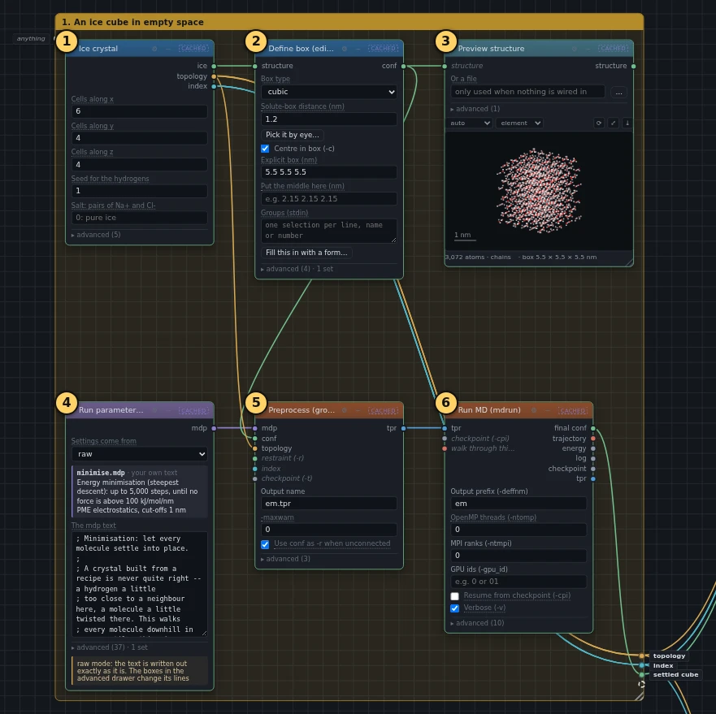
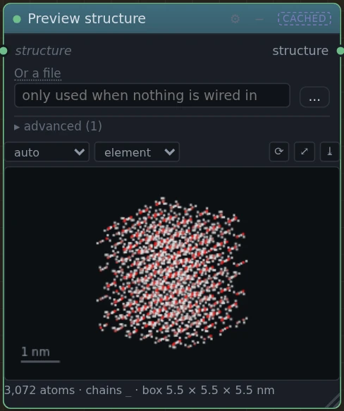

# 1. An ice cube in empty space

!!! abstract "In this box"
    Build a tiny ice cube, put it in the middle of a box of empty space, and
    let every molecule settle into place. **6 blocks.** No time passes in
    this box: it only gets the cube ready for box 2.

## What it does, and why

Ice is water whose molecules have stopped tumbling past each other. Each
molecule holds on to four neighbours with hydrogen bonds: it points its two
hydrogens at two of them, and the other two point a hydrogen at it. Together
they make a honeycomb of six-sided rings.

- **Ice crystal** puts 768 water molecules where ordinary ice puts them, and
  chooses which way each one points its hydrogens. The computer's rules for
  how the molecules push and pull on each other are a *water model*. The
  water model used here is called TIP4P/Ice: it draws each molecule as four
  points (an oxygen, two hydrogens, and an invisible point that carries the
  negative charge), and its numbers were chosen so that its ice melts at
  272 K, close to real ice at 273 K.
- **Define box (editconf)** puts the cube in the middle of a box 5.5 nm
  (nanometres) wide, full of nothing. A simulation box repeats in every
  direction, like tiles, so the box has to be big enough that the cube never
  feels the copy of itself next door.
- **Preview structure** shows the cube, so you can look at it before
  anything else happens.
- The other three blocks let the cube settle. A crystal built from a recipe
  is never quite right: a hydrogen a little too close to a neighbour here, a
  molecule a little twisted there. A *minimisation* walks every molecule
  downhill in energy until nothing is pushing hard any more. **Run
  parameters (.mdp)** holds the minimisation's settings. **Preprocess
  (grompp)** puts three things together into one run file: the cube, the
  list of what is in it (the *topology*), and the settings. **Run MD
  (mdrun)** does the work.

## What you will build

[{ .canvas }](../pictures/ice_melting/box-1.webp)

The yellow numbers are the order to add the blocks in, and the list below
goes through them one by one. Click the picture to see it full size.

## Build it

Start from an empty canvas: **New** in the toolbar, or **+** beside the tabs
at the top for a fresh tab. Add the blocks in order. For each one the list
says where to find it, which settings to change, and which wires go into it.

--8<-- "_generated/ice_melting/box-1-build.md"

When all six are in, you can draw the box around them (see
[Draw a box around blocks](../basics.md#draw-a-box-around-blocks)) and call
it *1. An ice cube in empty space*. The box is optional, but box 2 is easier
to wire with box 1 tidily in one place.

## Run it, and look

Press **Run**. This box takes a few seconds. Press **Check** first if you
like: it says if a wire is missing.

[{ .canvas }](../pictures/ice_melting/box-1-results.webp)

**Preview structure** now shows the cube: oxygens red, hydrogens white.
Drag the picture to turn it. Seen from one direction, straight down the
crystal's z axis, the six-sided rings line up into open channels. That open
structure is why ice is lighter than liquid water, and floats.

[{ .canvas }](../pictures/ice_melting/look.webp)

The minimisation leaves no picture of its own. Click **Run MD (mdrun)** and
read the end of its **Log** on the right: it says how many steps it took and
how strong the biggest push left over is.

## Under the hood

Most blocks run a program, usually GROMACS. These are the exact commands, the
same ones **Export scripts** in the toolbar writes out for a whole graph.
The **Command** tab on the right shows the command of the block you click.

--8<-- "_generated/ice_melting/box-1-commands.md"
