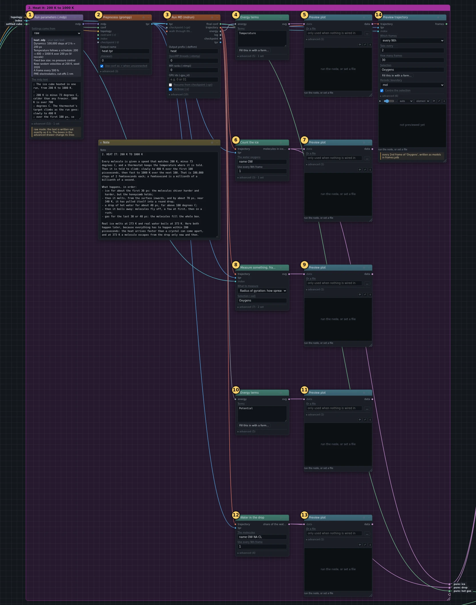
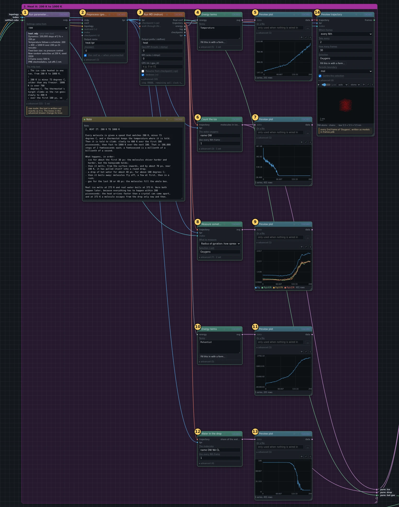
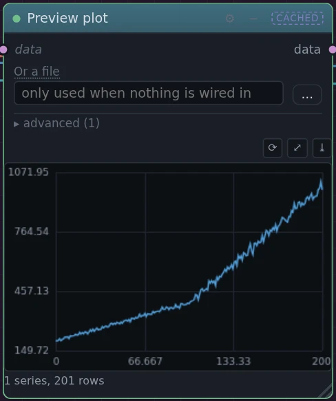
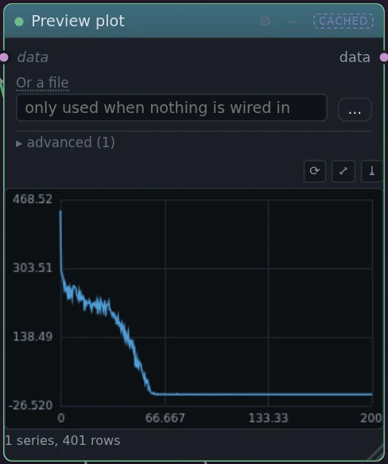
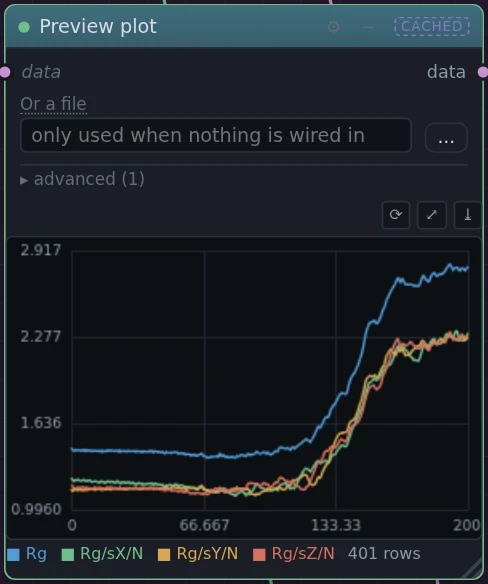
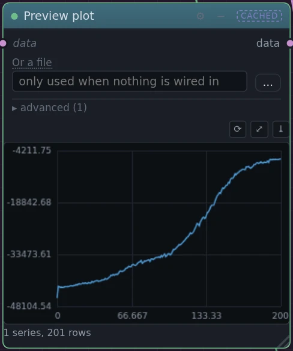
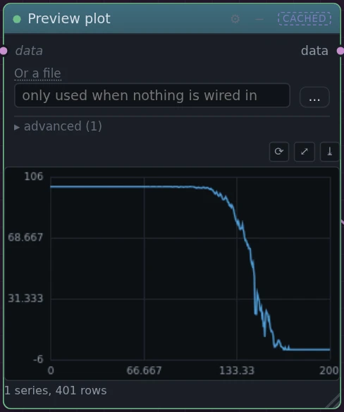
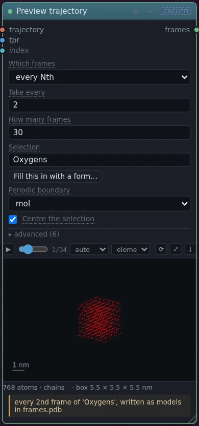

# 2. Heat it: 200 K to 1000 K

!!! abstract "In this box"
    Give every molecule a speed, and heat the cube in one run from 200 K to
    1000 K. Then look at what happened: five plots and a movie. **14
    blocks.** The run takes about 2½ minutes on one processor.

## What it does, and why

The first three blocks are the heating run itself. They are the same three
kinds of block as the minimisation in box 1, with other settings.

- **Run parameters (.mdp)** says what the run does. Every molecule is given
  a speed that matches 200 K, picked at random the way speeds are spread at
  that temperature. A *thermostat* then keeps the temperature at a target,
  by speeding the molecules up or slowing them down a little at every step.
  The target climbs as the run goes: slowly to 400 K over the first 100
  picoseconds (ps), then fast to 1000 K over the next 100 picoseconds.
  GROMACS calls a target that moves *annealing*. The run is 100,000 steps of
  2 femtoseconds each, 200 picoseconds in all. A femtosecond is a millionth
  of a billionth of a second, and a picosecond is a thousand femtoseconds.
- **Preprocess (grompp)** puts the settled cube from box 1, its topology and
  these settings together into the run file.
- **Run MD (mdrun)** runs it, and writes a *trajectory*: a series of
  pictures of the run, one every half picosecond, some 400 in all. Each
  picture records where every molecule is at that moment.

The other eleven blocks turn the trajectory into something you can see:

| blocks | what they draw |
| --- | --- |
| ④ ⑤ temperature | the thermometer: a gentle slope for 100 ps, then a steep one |
| ⑥ ⑦ count the ice | how many molecules still sit in the honeycomb, picture by picture |
| ⑧ ⑨ size | the *radius of gyration*: roughly how far the molecules are from the middle, on average |
| ⑩ ⑪ potential energy | how tightly the molecules hold on to each other |
| ⑫ ⑬ water in the drop | the share of the water still in the liquid drop |
| ⑭ movie | every second picture of the run, played inside the block |

Each pair in the table is one block that measures and one **Preview plot**
that draws the answer on the canvas, so you need not go looking for a file.

## What you will build

[{ .canvas }](../pictures/ice_melting/box-2.webp)

This box is tall. Click the picture to see it full size. The yellow note in
the middle of the box is optional: it holds the same explanation as this
page.

## Build it

Several wires come from box 1: the settled cube from its ⑥ **Run MD
(mdrun)**, and the topology and the list of molecule groups (the dot called
*index*) from its ① **Ice crystal**. In the wire tables below, those two
blocks are marked in box *1. An ice cube in empty space*.

--8<-- "_generated/ice_melting/box-2-build.md"

## Run it, and look

Press **Run**. Only the new blocks run: box 1 is marked **cached**, since
nothing in it changed. The heating run takes about 2½ minutes on one
processor; the plots follow within a minute.

[{ .canvas }](../pictures/ice_melting/box-2-results.webp)

What happens, in order:

1. **Ice** for about the first 30 ps. The molecules shiver harder and
   harder, but the honeycomb holds.
2. **Melting.** The corners go first, then the edges, then the faces. By
   60 to 70 ps, at 320 to 340 K, the crystal is gone and the liquid has
   pulled itself into a round drop.
3. **A drop of hot water** for about 40 to 50 ps, far above 100 °C.
4. **Boiling.** Molecules fly off the drop, a few at first, then in a rush.
5. **Gas** for the last 30 to 50 ps. The molecules fill the whole box.

How each plot shows it:

=== "Temperature"

    [{ .canvas }](../pictures/ice_melting/temp_plot.webp)

    The line follows the thermostat's target: a gentle slope, then a steep
    one. Use it to read off how hot the water was at any moment shown in
    the other plots.

=== "Count the ice"

    [{ .canvas }](../pictures/ice_melting/count_plot.webp)

    The count starts well below 768: a molecule on the surface of the cube
    has too few neighbours around it to be counted as ice. It then drops
    within the first picosecond, when the molecules start to shiver and
    some of them fail the strict test even though the crystal is still
    there. Its fall to zero, between 60 and 70 ps, is the melting.

=== "Size"

    [{ .canvas }](../pictures/ice_melting/size_plot.webp)

    Read the top line, `Rg`. It shrinks a little as the cube melts: a ball
    is more compact than a cube, and liquid water packs its molecules closer
    than ice does. Then it shoots up as the drop boils away, and levels off
    once the gas fills the box. The three lines below it are the same
    measure around each of the three axes. Their names are written in codes
    meant for another plotting program: `Rg/sX/N` stands for Rg with a
    small X below it.

=== "Potential energy"

    [{ .canvas }](../pictures/ice_melting/energy_plot.webp)

    The energy climbs the whole way, and fastest while the drop boils:
    warming only makes the molecules shake harder, but boiling pulls them
    apart altogether. That is why a pan of boiling water stays at 100 °C
    until it is dry: the heat goes into pulling molecules apart, not into
    making the water hotter.

=== "Water in the drop"

    [{ .canvas }](../pictures/ice_melting/drop_plot.webp)

    Nearly all the water is in the drop until the drop starts to boil. Then
    the share falls to nothing.

=== "Movie"

    [{ .canvas }](../pictures/ice_melting/watch.webp)

    Press ▶ to play it, drag the slider to go to a moment, and drag the
    picture to turn it: a cube, then a ball, then a cloud.

!!! question "Why does it melt and boil so late?"
    The water model's ice melts at 272 K, and real water boils at 373 K.
    Here the crystal is gone only at 320 to 340 K, and the drop boils above
    400 K.
    The heat arrives far faster than in any kitchen, 2 degrees every
    picosecond and later 6, and a crystal needs time to come apart. So the
    ice is briefly warmer than its melting point, and the drop warmer than
    its boiling point.

Your numbers will differ a little from these. Two computers round their
arithmetic in slightly different ways, the differences grow over a run, and
no two runs follow quite the same path.

## Under the hood

The commands each block runs, as **Export scripts** writes them. The heating
run's whole settings file is under ①.

--8<-- "_generated/ice_melting/box-2-commands.md"
