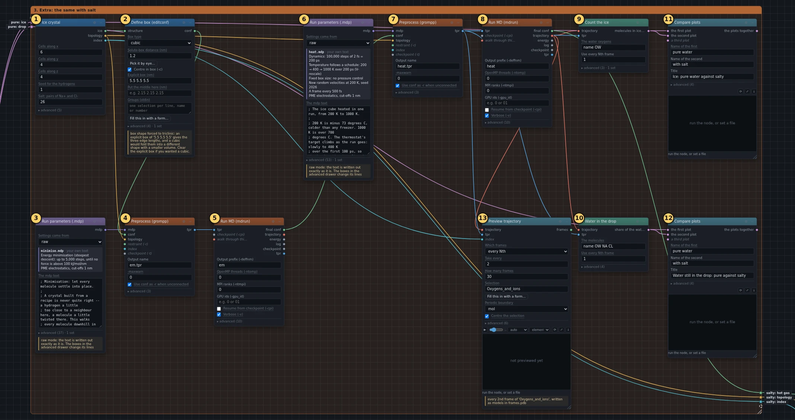
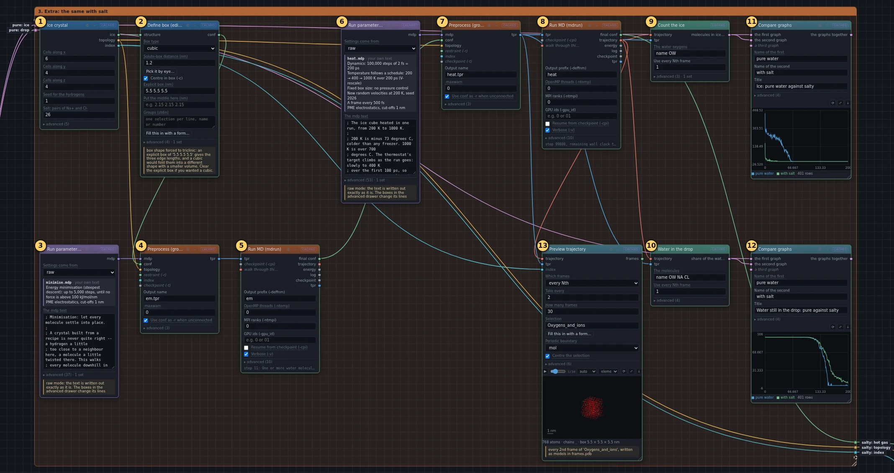
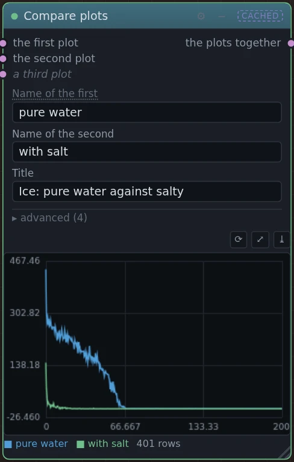
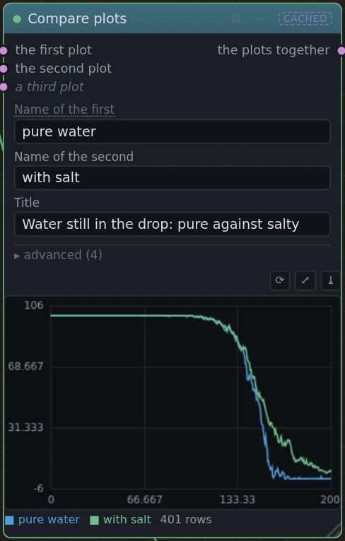
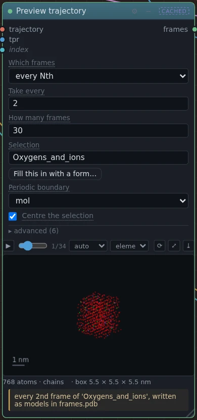

# 3. Extra: the same with salt

!!! abstract "In this box"
    The same ice cube with salt in it, settled and heated exactly like the
    pure one, and the two set side by side. **13 blocks.** The run takes
    about as long as box 2's.

## What it does, and why

Salt in water falls apart into ions, and each ion holds on to the water
molecules around it. A molecule held by an ion is less free to fly off, so
salty water has to be hotter before it boils. The ions also get in the way of
the molecules locking into the pattern of ice, so salty water has to be
colder before it freezes. That is why roads are salted in winter.

This box asks whether the simulation shows it.

- **Ice crystal** builds the same cube, with 26 water molecules swapped for
  sodium ions (Na⁺) and 26 for chloride ions (Cl⁻). That is 2 moles of salt
  per kilogram of water, over three times as salty as the sea.
- The next five blocks settle it and heat it, exactly as boxes 1 and 2 do,
  with copies of the same two **Run parameters (.mdp)**. A fair comparison
  needs the same treatment: if you change the heating in box 2, change it
  here too.
- **Count the ice** and **Water in the drop** measure the salty run, and two
  **Compare graphs** blocks draw each next to its pure-water partner from
  box 2.
- **Preview trajectory** makes the salty movie, with the ions in it.

## What you will build

[{ .canvas }](../pictures/ice_melting/box-3.webp)

## Build it

The first eight blocks are copies of blocks you already have: ① and ② are
like ① and ② of box 1, ③ to ⑤ like ④ to ⑥ of box 1, and ⑥ to ⑧ like ① to ③
of box 2. The quickest way to them is to copy those eight:

1. Click the first of them, then hold ++shift++ and click each of the others.
2. Press ++ctrl+d++ (on a Mac, ++cmd+d++). Copies appear a little below and to
   the right, already selected, with the same settings and with the wires
   that ran between the eight.
3. Drag any one of the copies by its title bar: all of them move together.
   Put them in an empty spot.

Then change what the list below changes, and draw the wires it lists that
are still missing. Building the eight one by one works just as well.

--8<-- "_generated/ice_melting/box-3-build.md"

## Run it, and look

Press **Run**. Only this box runs: everything the pure cube produced is
reused.

[{ .canvas }](../pictures/ice_melting/box-3-results.webp)

=== "Ice"

    [{ .canvas }](../pictures/ice_melting/cmp_ice.webp)

    **The salty ice melts sooner.** Every ion breaks the honeycomb around
    it, so fewer molecules pass the ice test from the start, and the rest
    give way at a lower temperature.

=== "Water in the drop"

    [{ .canvas }](../pictures/ice_melting/cmp_drop.webp)

    **The salty drop holds on to its water for longer.** It starts losing
    water at nearly the same moment as the pure one, but the last tenth
    stays much longer, and a few per cent never leave the ions at all.

=== "Movie"

    [{ .canvas }](../pictures/ice_melting/salt_watch.webp)

    The ions are in it: sodium in purple, chloride in green.

!!! warning "The right direction, not the right size"
    In a kitchen, this much salt raises the boiling point by about 2 degrees
    and lowers the freezing point by about 7. Here both shifts are tens of
    degrees. The heating is very fast, which stretches every difference; the
    tiny drop gets saltier as it boils, until the last water molecules are all
    held by ions; and real ice pushes salt out as it freezes, so a crystal
    with ions all through it is weaker than any nature makes. The simulation
    shows which way salt pushes, and why, but not by how much.

## Under the hood

--8<-- "_generated/ice_melting/box-3-commands.md"
