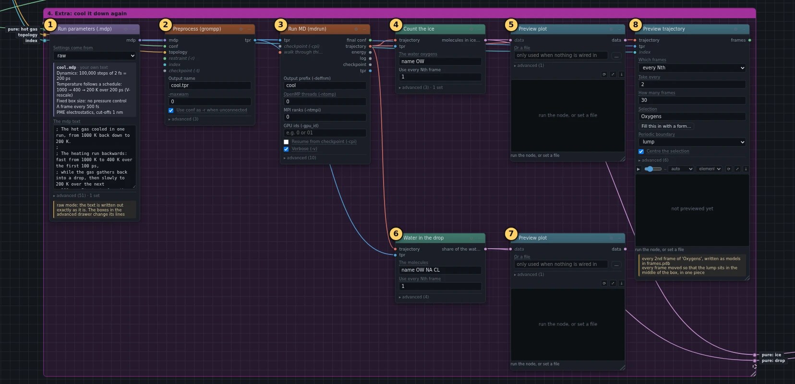
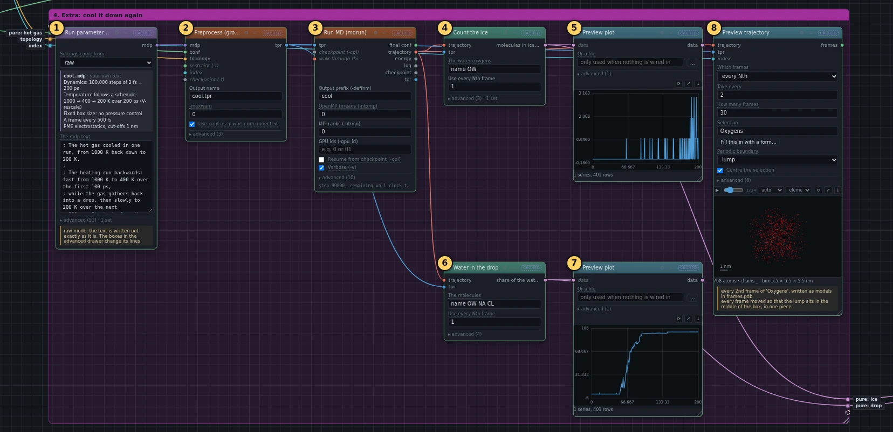
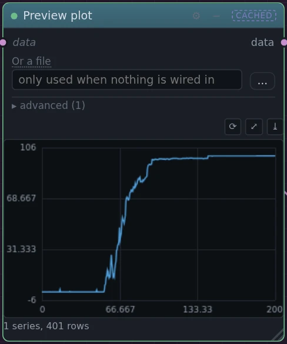
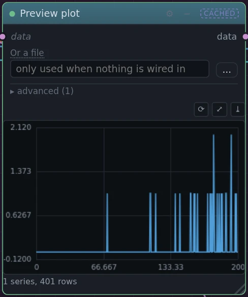
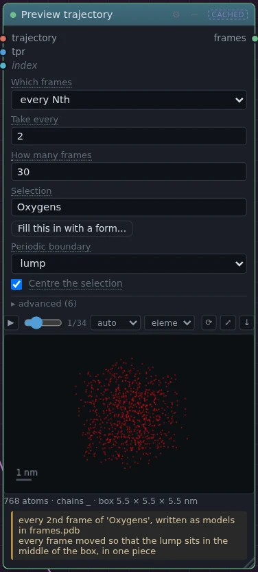

# 4. Extra: cool it down again

!!! abstract "In this box"
    Take the hot gas at the end of the heating run and cool it back down to
    200 K. Does the ice come back? **8 blocks.** The run takes about as long
    as the heating.

## What it does, and why

- **Run parameters (.mdp)** runs the heating schedule backwards: fast from
  1000 K to 400 K over the first 100 picoseconds, then slowly to 200 K over
  the next 100 picoseconds.
- **Preprocess (grompp)** starts from the heating run's last picture, which
  comes out of the dot called *final conf* on box 2's **Run MD (mdrun)**.
  That file holds where every molecule was and how fast it was moving, so
  the cooling picks up exactly where the heating left off: nothing jumps.
- **Run MD (mdrun)** runs it.
- **Count the ice** and **Water in the drop**, each with a **Preview plot**,
  measure the cooling run, just as they measured the heating.
- **Preview trajectory** makes the movie. Its *Periodic boundary* is set to
  **lump**, for this reason: the drop forms wherever the gas happens to
  gather, often across an edge of the box, and because the box repeats in
  every direction, the usual setting would draw the drop cut in two, half at
  each side. Set to **lump**, the block moves every picture so that the drop
  sits whole in the middle.

## What you will build

[{ .canvas }](../pictures/ice_melting/box-4.webp)

## Build it

--8<-- "_generated/ice_melting/box-4-build.md"

## Run it, and look

Press **Run**. Only this box runs: the heating is reused.

[{ .canvas }](../pictures/ice_melting/box-4-results.webp)

=== "Water in the drop"

    [{ .canvas }](../pictures/ice_melting/cool_drop_plot.webp)

    **The gas turns back into one body of water.** As the molecules slow
    down, the ones that meet stick together again, and by about 400 K nearly
    all of them are back. The water gathers again at a lower temperature
    than the one at which it boiled away.

=== "Count the ice"

    [{ .canvas }](../pictures/ice_melting/cool_count_plot.webp)

    **The ice does not come back.** Now and then a few molecules pass the
    ice test by chance, as in any cold water, but nothing like the hundreds
    at the start of the heating returns, not even at 200 K.

=== "Movie"

    [{ .canvas }](../pictures/ice_melting/cool_watch.webp)

    The water may end as a round drop, or as a thick column that leaves the
    box through one side and comes back in through the other, joined to
    itself. In a box this small the two shapes have almost the same surface,
    so either can form. Either way it is one body of water.

!!! question "Why does the ice not come back?"
    Melting and freezing are not mirror images. A crystal can start to melt
    anywhere on its surface. Freezing has to start from a seed: a cluster of
    molecules that happen to line up into the pattern of ice together, big
    enough to grow rather than fall apart again. Such a seed is rare, so pure
    water can stay liquid well below 0 °C; the tiny droplets in clouds stay
    liquid down to about −38 °C. In a glass of water, freezing starts on dust
    or a scratch in the glass. The drop here has nothing like that, and
    200 picoseconds is far too short for a seed to form on its own.

## Under the hood

--8<-- "_generated/ice_melting/box-4-commands.md"
