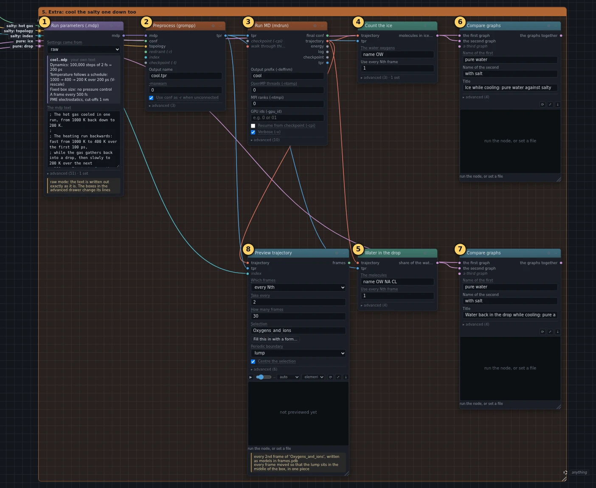
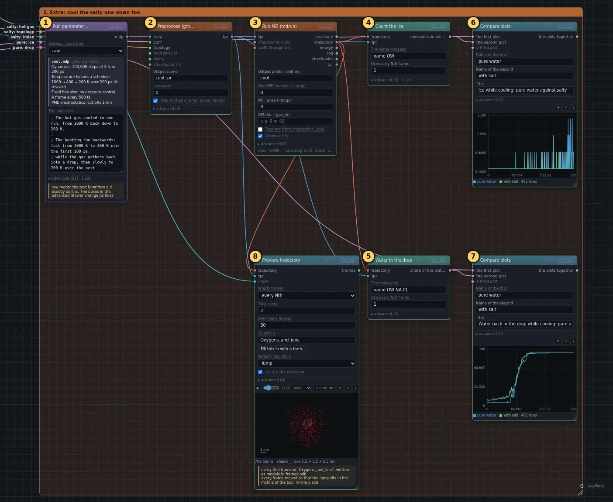
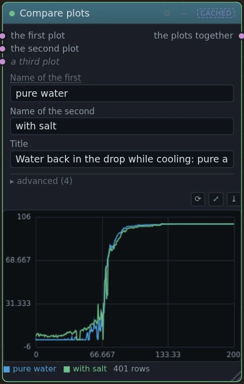
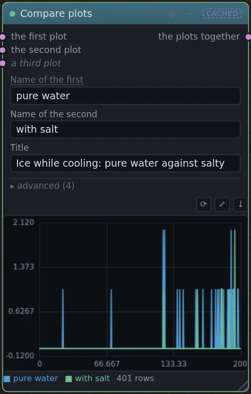
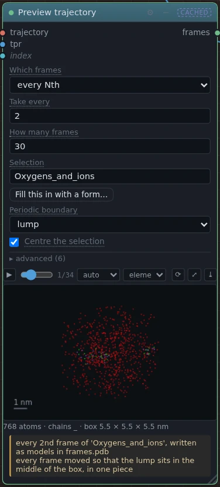

# 5. Extra: cool the salty one down too

!!! abstract "In this box"
    Box 4 again, for the salty gas from box 3, and the two cooling runs set
    side by side. **8 blocks.** It needs boxes 3 and 4 built first.

## What it does, and why

This box cools the salty gas exactly as box 4 cools the pure gas, starting
from the last picture of the salty heating run in box 3. Its **Run
parameters (.mdp)** is a copy of box 4's: if you change one, change the
other, or the comparison is not fair. Two **Compare plots** blocks set the
salty run's ice count and water in the drop next to the pure run's from box
4. **Preview trajectory** makes the movie, with the ions in it and
*Periodic boundary* set to **lump**, as in box 4.

## What you will build

[{ .canvas }](../pictures/ice_melting/box-5.webp)

## Build it

The first three blocks are copies of box 4's ① to ③: select them, press
++ctrl+d++, move the copies here, and wire them to box 3 instead of box 2, as
the list says.

--8<-- "_generated/ice_melting/box-5-build.md"

## Run it, and look

Press **Run**. Only this box runs.

[{ .canvas }](../pictures/ice_melting/box-5-results.webp)

=== "Water in the drop"

    [{ .canvas }](../pictures/ice_melting/cmp_cool_drop.webp)

    The salty drop starts from the water that never left its ions, and
    gathers the rest back about as the pure one does: in some runs a little
    sooner, in others a little later. That part is chance.

=== "Ice"

    [{ .canvas }](../pictures/ice_melting/cmp_cool_ice.webp)

    No ice comes back in either.

=== "Movie"

    [{ .canvas }](../pictures/ice_melting/salt_cool_watch.webp)

    It shows the ions too: sodium in purple, chloride in green.

## Under the hood

--8<-- "_generated/ice_melting/box-5-commands.md"
