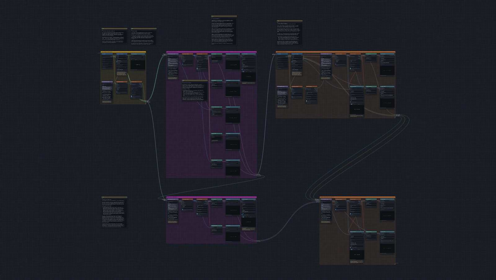

# An ice cube melting

A tiny ice cube of 768 water molecules, about 3 nanometres across, floats in
empty space. One run heats it from 200 kelvin (K), which is −73 °C and
colder than any freezer, to 1000 K (727 °C), hotter than any kettle. On the
way you see ice, a drop of liquid water and a gas, one after the other.
Three extra boxes do it again with salt in the ice, then cool the pure gas
and the salty gas back down.

[{ .canvas }](../pictures/ice_melting/whole.webp)

To build along, open Comfy-gmx lite in another browser tab: { .binder-button }

## The boxes

| box | what it does | blocks |
| --- | --- | --- |
| [1. An ice cube in empty space](1-cube.md) | builds the crystal, puts it in a box of empty space, and lets every molecule settle | 6 |
| [2. Heat it](2-heat.md) | heats it from 200 K to 1000 K in one run, and draws five graphs and a movie of what happens | 14 |
| [3. Extra: the same with salt](3-salt.md) | the same cube with salt in it, heated the same way, and the two compared | 13 |
| [4. Extra: cool it down again](4-cool.md) | cools the hot gas back to 200 K: does the ice come back? | 8 |
| [5. Extra: cool the salty one down too](5-cool-salty.md) | the same for the salty gas, and the two compared | 8 |

Boxes 1 and 2 are the tutorial. Boxes 3 to 5 are extras for when there is
time. In the ready-made tutorial they come switched off, so **Run** leaves
them out until you switch them on: right-click the box's title bar and
choose **Switch this chunk back on**.

## How long it takes

On mybinder.org, with one processor, boxes 1 and 2 take about 3 minutes from
**Run** to the last block. Almost all of it is the heating run in box 2.
Each extra box runs about as long again.

## What you need to know first

Nothing about simulations. The pages say what each step is for as you build
it. If you have not used the editor before, read
[Before you start](../basics.md) first: it shows the parts of the screen and
how to add, wire and run blocks.

## For teachers

The
[teacher's notes](https://github.com/CWoodkid/comfy-gmx-lite/blob/main/docs/ice-melting.md)
say what the class should see on each graph and in the movie, explain the
science behind the melting and the boiling, say how the tutorial was set up
and why, and list things to try afterwards.
