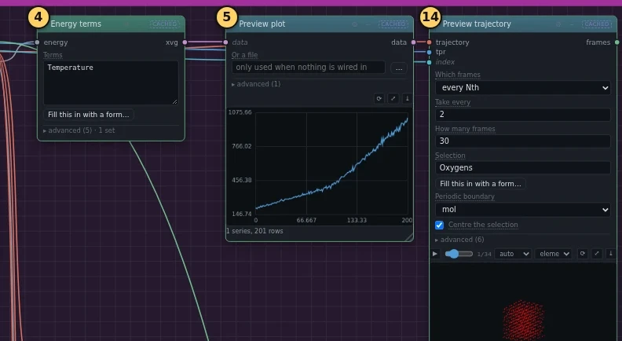

---
hide:
  - navigation
  - toc
---

# Comfy-gmx lite tutorials

Molecular dynamics simulations in a web browser, without typing commands:
put **blocks** on a canvas, join them with **wires**, and press **Run**.

[Start with the ice cube](ice/index.md){ .md-button .md-button--primary }
[Open the editor online](https://mybinder.org/v2/gh/CWoodkid/comfy-gmx-lite/main?urlpath=comfygmx/){ .md-button }

A molecular dynamics simulation is a calculation that follows how molecules
move, one tiny step in time after another. Each block does one step, such as
building a box of water, running the simulation program GROMACS, or drawing
a plot. Each wire carries a file from the block that makes it to the block
that needs it.

The editor comes with two tutorials, ready to load and run. On the canvas,
each tutorial is split into boxes: one box of blocks for each step, with its
number and name on top. This site goes through the tutorials one box at a
time, so that you can **build them yourself**. For each box it says which
blocks to add, which settings to change, which wires to draw, what you should
see at the end, and the GROMACS commands behind every block.

-   :material-snowflake:{ .lg .middle } **[An ice cube melting](ice/index.md)**

    ---

    A tiny ice cube heated from colder than any freezer to hotter than any
    kettle: it melts into a drop, and the drop boils away. Made for a school
    workshop. About 3 minutes to run online.

-   :material-molecule:{ .lg .middle } **[Lysozyme in water](lysozyme/index.md)**

    ---

    The classic first GROMACS tutorial: a protein in a box of water, taken
    through every step of a standard simulation, from describing the protein
    to the plots at the end. Every run is cut short so that it fits a
    lesson. About 9 minutes to run online.

## Open Comfy-gmx lite

**Online**, with nothing to install: { .binder-button }

The button opens it on mybinder.org; the same button is in the bar at the top
of every page. The first start takes a minute or two, and longer for a while
after a new version of Comfy-gmx lite has come out. Each person gets a copy
of their own. The copy closes after 10 minutes without activity, and
everything in it is lost: the blocks, the wires and the results. To keep
what you built, press **Export JSON**: it saves the blocks and wires on the
canvas, which the editor calls a *graph*, as a file on your own computer.
**Import JSON** brings that file back into a new copy later.

**On your own computer**: the
[README](https://github.com/CWoodkid/comfy-gmx-lite#running-on-a-local-computer)
says how to install it.

## Two ways to use a tutorial

1. **Load it ready-made.** Open **Tutorials** on the left, click the
   tutorial, press **Load as new graph**, then **Run**. While it runs, read
   the notes that come with it on the canvas.
2. **Build it yourself**, with these pages. Start from an empty canvas and
   follow the boxes in order. Each page says what its box is for, shows the
   finished box, and goes through its blocks one by one. Building a tutorial
   once by hand is the best way to see how the steps of a simulation fit
   together.

Both ways end with the same blocks and wires, so you can always load the
ready-made tutorial next to yours and compare the two: **+** beside the tabs
at the top gives a second, empty tab to load it into.

## New to the mouse and keyboard?

The editor opens with a two-minute tour of clicking, dragging, wiring, moving
around and right-clicking. To see the tour again, press **?** at the top
right, then **Show the basics**. [Before you start](basics.md) shows the
parts of the screen and the few things you do again and again in these
tutorials.

## Where the tutorials come from

**Lysozyme in water** turns the first of Justin A. Lemkul's GROMACS
tutorials into blocks. The original explains far more than these pages, and
each page here links to the step it follows. If you use the tutorial in work
of your own, cite the original:

> Lemkul, J. A. (2018) From Proteins to Perturbed Hamiltonians: A Suite of
> Tutorials for the GROMACS-2018 Molecular Simulation Package. *Living J.
> Comput. Mol. Sci.* 1(1), 5068.
> [doi:10.33011/livecoms.1.1.5068](https://doi.org/10.33011/livecoms.1.1.5068)

**An ice cube melting** was written for Comfy-gmx lite; it does not follow a
published tutorial. Its
[teacher's notes](https://github.com/CWoodkid/comfy-gmx-lite/blob/main/docs/ice-melting.md)
explain the science behind what happens on the screen, why the tutorial was
set up the way it is, what a class should see on each plot and in the movie,
and what to try afterwards.
