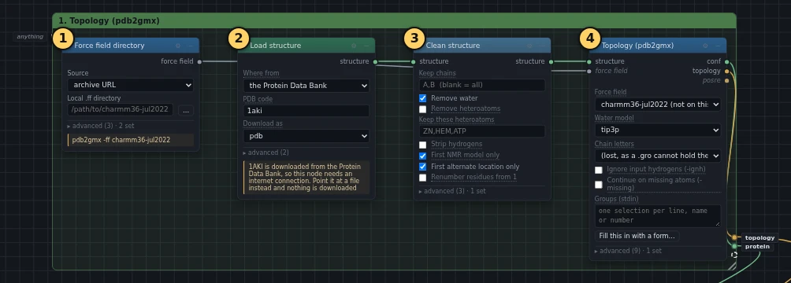
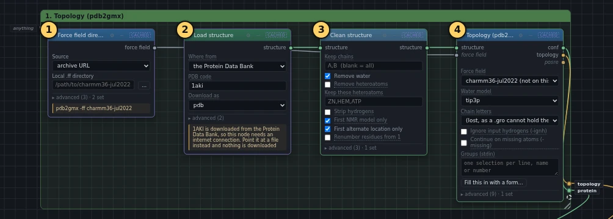

# 1–2. Topology

!!! abstract "In this box"
    Download the protein and the force field, take out the water that came
    with the crystal, and write the *topology*: the file that tells GROMACS
    what every atom is and how it is joined to the others. **4 blocks.** It
    takes a few seconds.

Published tutorial:
[Step One: Prepare the Topology](http://www.mdtutorials.com/gmx/lysozyme/01_pdb2gmx.html)
and
[Step Two: Examine the Topology](http://www.mdtutorials.com/gmx/lysozyme/02_topology.html).

## What it does, and why

A simulation needs two things about every atom: where it is, and how it
behaves. A structure file only has the first. The topology adds the second:
which element each atom is, its electric charge, which atoms it is bonded
to, and how stiff those bonds are.

- **Force field directory** downloads CHARMM36, the *force field*: the set of
  rules, measured and fitted over decades, for how each kind of atom pushes
  and pulls on the others. GROMACS does not come with CHARMM36, so the block
  fetches it from the website of the lab that makes it.
- **Load structure** fetches entry 1AKI from the Protein Data Bank, the
  public archive of measured protein structures. It is hen egg-white
  lysozyme, measured by X-ray crystallography.
- **Clean structure** removes the water molecules that were measured in the
  crystal along with the protein. The simulation adds water of its own
  later. Keeping crystal water is right only when it does a job, for example
  inside the active site; here it does not.
- **Topology (pdb2gmx)** reads the cleaned structure and writes three files:
  the structure with hydrogens added, since X-ray structures rarely show
  them; the topology; and a list of the protein's heavy atoms that later
  runs use to hold the protein in place. It also chooses the water model,
  TIP3P, which draws each water molecule as three points.

## What you will build

[{ .canvas }](../pictures/lysozyme/box-1.webp)

The yellow numbers are the order to add the blocks in. Click the picture to
see it full size.

## Build it

Start from an empty canvas: **New** in the toolbar, or **+** beside the tabs
at the top for a fresh tab. Add the blocks in order. For each one the list
says where to find it, which settings to change, and which wires go into it.

--8<-- "_generated/lysozyme/box-1-build.md"

The **Force field** of ④ already says `charmm36-jul2022`, followed by *(not
on this machine)*. That is fine: the computer's own GROMACS does not have
it, and it arrives through the wire from ① instead.

When all four are in, you can draw a box around them
([how](../basics.md#draw-a-box-around-blocks)) and call it
*1. Topology (pdb2gmx)*. It is optional, but it keeps the canvas readable as
the tutorial grows.

## Run it, and look

Press **Run**. Online, the box takes about a second: the protein and the
force field come already downloaded with the copy, so ① and ② are marked
**cached**. On your own computer the downloads take a few seconds the first
time.

[{ .canvas }](../pictures/lysozyme/box-1-results.webp)

Click **Topology (pdb2gmx)** and read its **Log** on the right. Two lines
matter:

- `Now there are 129 residues with 1960 atoms`: the crystal structure has
  1001 atoms, and pdb2gmx added 959 hydrogens.
- `Total charge 8.000 e`: the protein carries eight more positive charges
  than negative ones. Box 4 deals with that.

## Look inside the topology

Step two of the published tutorial runs nothing: it reads the topology. To
read it here, open **Files** on the right, find the files of **Topology
(pdb2gmx)**, and press **↓** beside `topol.top`. That saves the file to your
computer, where any text editor opens it.

Clicking the name instead shows only the end of the file in the **Log**
tab, because the file is too long to show whole. The end has `[ molecules ]`
and the line that includes the restraint file, but not the start.

What to look for, in order from the top:

| section | what it holds |
| --- | --- |
| `[ moleculetype ]` | the molecule's name, here `Protein_chain_A` |
| `[ atoms ]` | one line per atom: its kind, its residue, its charge and its mass |
| `[ bonds ]`, `[ pairs ]`, `[ angles ]`, `[ dihedrals ]` | which atoms are joined, and how |
| `#ifdef POSRES` | brings in the restraint file, but only when a run asks for it, as boxes 6 and 7 do |
| `[ molecules ]` | what is in the system, and how many of each: so far, one protein |

The published tutorial goes through each section in detail.

## Under the hood

Each block runs a program, mostly GROMACS. These are the exact commands, the
same ones **Export scripts** in the toolbar writes out for a whole graph.
The **Command** tab on the right shows them for the block you click.

**Clean structure** and **Topology (pdb2gmx)** also run small Python scripts
that come with Comfy-gmx: one removes the water, the other checks that every
atom is there before pdb2gmx starts. By hand, the published tutorial removes
the water with `grep -v HOH 1aki.pdb > 1AKI_clean.pdb`.

--8<-- "_generated/lysozyme/box-1-commands.md"
