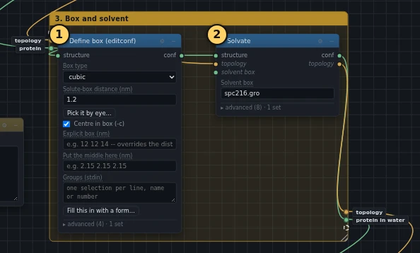
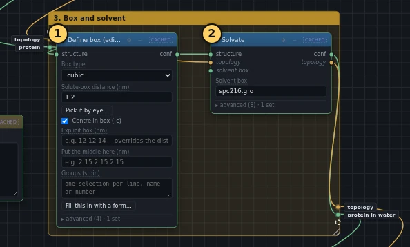

# 3. Box and solvent

!!! abstract "In this box"
    Put the protein in the middle of a box, and fill the box with water.
    **2 blocks.** It takes about a second.

Published tutorial:
[Step Three: Defining the Unit Cell & Adding Solvent](http://www.mdtutorials.com/gmx/lysozyme/03_solvate.html).

## What it does, and why

- **Define box (editconf)** puts the protein in the middle of a cube, with
  at least 1.2 nm between the protein and every side. A simulation box
  repeats in every direction, like tiles, and the protein in the next tile
  is a copy of this one. The force field only counts how two atoms act on
  each other up to a set distance. With 1.2 nm on every side, two copies are
  always at least 2.4 nm apart, twice that distance, so the protein never
  feels its own copy.
- **Solvate** fills the box with water. It copies a small ready-made box of
  216 water molecules side by side until the big box is full, then removes
  every water molecule that overlaps the protein. That small box was made
  for a slightly different three-point water model. Any three-point model
  can start from it, and the minimisation in box 5 settles the difference.
  Solvate also adds the water to the topology's `[ molecules ]` list, so
  that the topology still lists everything the structure holds.

A fresh block's box shape is a *rhombic dodecahedron*, a shape with twelve
faces. It needs about 30% less water than a cube for the same 1.2 nm gap
around the protein. The published tutorial uses a cube, which is easier to
picture, so the list below changes the shape to a cube.

## What you will build

[{ .canvas }](../pictures/lysozyme/box-2.webp)

## Build it

Both blocks take wires from **Topology (pdb2gmx)**, block ④ of the previous
box. In the tables below, a wire that comes from another box says so beside
the block's name: in box *1. Topology (pdb2gmx)*.

--8<-- "_generated/lysozyme/box-2-build.md"

## Run it, and look

Press **Run**. The blocks of box 1 are marked **cached** and not run again,
since nothing in them changed. This box takes about a second.

[{ .canvas }](../pictures/lysozyme/box-2-results.webp)

Click each block and read the end of its **Log** on the right:

- **Define box (editconf)**: the protein measures 5.01 nm across at its
  widest (`diameter`), so the cube is 5.01 + 2 × 1.2 = 7.41 nm wide
  (`new box vectors`).
- **Solvate**: `Number of solvent molecules: 12597`. The box now holds
  39,751 atoms, and almost all of them are water: only 1960 belong to the
  protein.

## Under the hood

--8<-- "_generated/lysozyme/box-2-commands.md"
