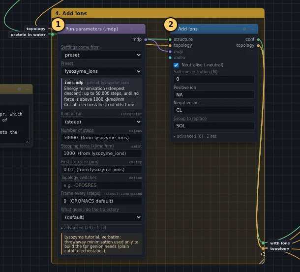
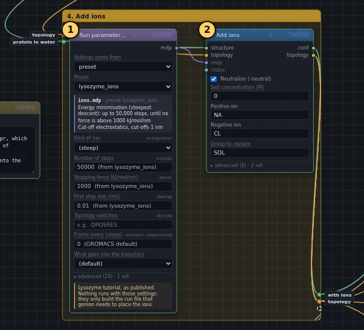

# 4. Add ions

!!! abstract "In this box"
    Swap 8 water molecules for chloride ions, so that the box as a whole
    carries no electric charge. **2 blocks.** It takes about 10 seconds.

Published tutorial:
[Step Four: Adding Ions](http://www.mdtutorials.com/gmx/lysozyme/04_ions.html).

## What it does, and why

Box 1 found that lysozyme carries a charge of +8. A simulation box repeats
in every direction, so a charged box, repeated without end, would add up to
an endless charge. The method that adds up the long-range electric forces
then has to pretend that an even haze of opposite charge fills the box, and
that pretence distorts the result. Real salt water is neutral anyway. So
8 negative chloride ions (Cl⁻) take the places of 8 water molecules.

- **Run parameters (.mdp)** holds the settings file `ions.mdp`, copied from
  the published tutorial. No simulation runs with these settings: they are
  only needed to build the run file described next.
- **Add ions** does two things in a row. The program that places the ions,
  `gmx genion`, needs a *run file* (`.tpr`), the one file that holds the
  structure, the topology and the settings together. So the block first
  builds one with `gmx grompp`, and throws it away after use. Then genion
  picks 8 water molecules at random, replaces each with a chloride ion, and
  updates the topology to match. The block's **Group to replace** is `SOL`,
  the water, so that no ion is put in place of an atom of the protein.

Two settings change from a fresh block:

- **Salt concentration (M)** goes from 0.15 to 0. A fresh block's value, 0.15,
  would add salt as well, as much as in the body. The published tutorial
  only cancels the charge.
- **grompp -maxwarn** goes from 1 to 0, as in the published command. A
  fresh block lets grompp pass one warning, because grompp usually warns
  that the system is charged, the very thing this block is about to fix.
  With this box's settings, grompp gives no warning, so none needs to be
  let through.

## What you will build

[{ .canvas }](../pictures/lysozyme/box-3.webp)

## Build it

--8<-- "_generated/lysozyme/box-3-build.md"

## Run it, and look

Press **Run**. The new box takes about 10 seconds online, almost all of it
in grompp.

[{ .canvas }](../pictures/lysozyme/box-3-results.webp)

Click **Add ions** and read its **Log**:

- `Number of (3-atomic) solvent molecules: 12597`: the water from box 3.
- `Will try to add 0 NA ions and 8 CL ions.`, followed by eight lines
  saying which water molecule each ion replaced.

The topology now ends with 1 protein, 12,589 water molecules and 8 chloride
ions.

## Under the hood

--8<-- "_generated/lysozyme/box-3-commands.md"
