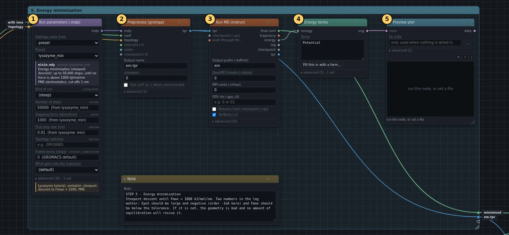
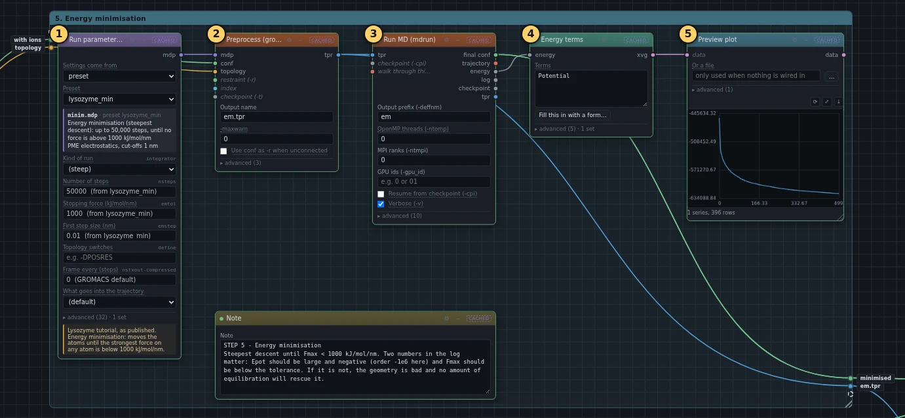
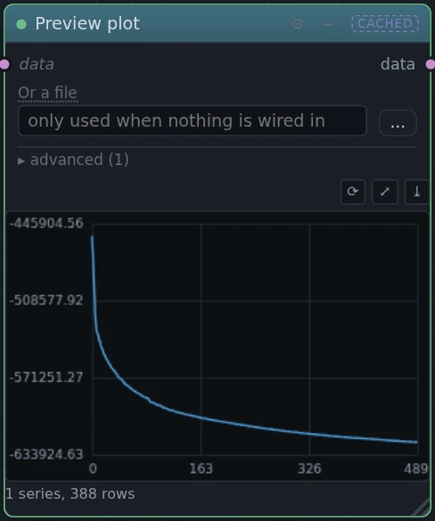

# 5. Energy minimisation

!!! abstract "In this box"
    Move every atom out of the way of its neighbours before anything is
    allowed to move freely, and draw how the energy falls. **5 blocks.** It
    takes under a minute online.

Published tutorial:
[Step Five: Energy Minimization](http://www.mdtutorials.com/gmx/lysozyme/05_EM.html).

## What it does, and why

The system so far was put together from parts: hydrogens placed by a rule,
water copied in from tiles, ions dropped in where water was. Some atoms sit
much too close to others. Start a simulation like that and the huge forces
between them fling the atoms apart, and the run crashes in its first steps.

A *minimisation* fixes that. Its steps are not time steps: no time passes,
and nothing has a speed or a temperature. At each step it moves every atom
a little in the direction the forces push it, which lowers the energy. When
a step helps, the next one is bigger; when it overshoots, the next one is
smaller. It stops when the strongest push on any atom is below
1000 kJ/mol/nm. This kind of minimisation is called *steepest descent*.

- **Run parameters (.mdp)** uses the preset `lysozyme_min`, the published
  `minim.mdp`, unchanged.
- **Preprocess (grompp)** puts the structure with ions, its topology and
  these settings together into the run file `em.tpr`. Its **Use conf as -r
  when unconnected** is switched off. That setting is for runs that hold
  atoms in place and need positions to hold them at; a minimisation holds
  nothing in place. Switching it off also keeps the command the same as the
  published one.
- **Run MD (mdrun)** runs the minimisation.
- **Energy terms** takes the *potential energy*, the energy stored in the
  pushes and pulls between the atoms, step by step out of the energy file
  mdrun writes, and **Preview plot** draws it.

## What you will build

[{ .canvas }](../pictures/lysozyme/box-4.webp)

## Build it

--8<-- "_generated/lysozyme/box-4-build.md"

## Run it, and look

Press **Run**. The minimisation takes about 40 seconds online, and grompp
another 10.

[{ .canvas }](../pictures/lysozyme/box-4-results.webp)

The graph in **Preview plot** falls steeply over the first few dozen steps,
as the worst clashes are pulled apart, and then flattens out. In our run
the energy went from −4.6 × 10⁵ to −6.24 × 10⁵ kJ/mol.

[{ .canvas }](../pictures/lysozyme/plot_pot.webp)

Two numbers at the end of the **Log** of **Run MD (mdrun)** say whether the
minimisation worked:

| line in the log | in our run | what it should be |
| --- | --- | --- |
| `Potential Energy` | −6.24 × 10⁵ kJ/mol | negative, and large: for a protein in water, between about 10⁵ and 10⁶ |
| `Maximum force` | 826 kJ/mol/nm | below 1000, the stopping value |

The log also says `Steepest Descents converged to Fmax < 1000 in 490
steps`: it reached its goal in 490 steps. Your count will differ a little:
the published tutorial needed 566. If the maximum force does not get below
1000, something in the structure is badly wrong, and no amount of warming
up later will rescue it.

## Under the hood

--8<-- "_generated/lysozyme/box-4-commands.md"
