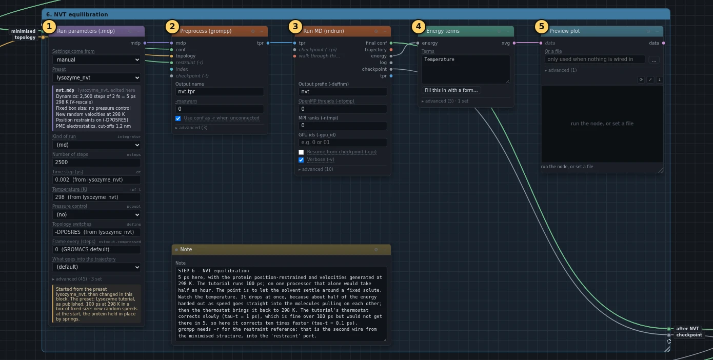
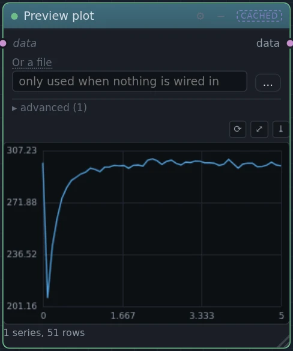

# 6. NVT equilibration

!!! abstract "In this box"
    Give every atom a speed, warm the system to 298 K, and let the water
    settle around the protein while the protein is held in place. **5
    blocks.** About 2 minutes online.

Published tutorial:
[Step Six: Equilibration](http://www.mdtutorials.com/gmx/lysozyme/06_equil.html).

## What it does, and why

The minimised system is still: no atom moves. Before the real run, two
things must settle, the temperature and then the pressure. This box does the
temperature. *NVT* is short for what stays fixed: the Number of atoms, the
Volume of the box and the Temperature.

- At the start every atom gets a random speed, drawn the way speeds are
  spread at 298 K. A *thermostat* then keeps the temperature at 298 K, by
  speeding the atoms up or slowing them down a little at every step.
- The heavy atoms of the protein are held in place by *position restraints*:
  springs that pull each atom back to where it was after the minimisation.
  The water was placed around a protein that did not move, so it needs time
  to arrange itself. Without the springs, the first rough moments could push
  the protein out of shape. This is the list of atoms box 1 wrote; the
  setting `define = -DPOSRES` in the preset switches it on.

The blocks:

- **Run parameters (.mdp)** starts from the preset `lysozyme_nvt`, the
  published `nvt.mdp`, and changes three values. The run is 2,500 steps of
  2 femtoseconds, 5 ps in all, where the published run is 100 ps. The
  thermostat corrects within 0.1 ps instead of 1 ps: with the published
  value, the temperature was still at 278 K after 5 ps, short of the target.
  And the energies are saved every 50 steps instead of every 2,500, so that
  the short run still gives a curve.
- **Preprocess (grompp)** takes the minimised structure twice: once as the
  starting positions, and once, on its **restraint (-r)** dot, as the
  positions the springs pull towards.
- **Run MD (mdrun)** runs it.
- **Energy terms** takes the temperature out of the energy file, and
  **Preview plot** draws it.

## What you will build

[{ .canvas }](../pictures/lysozyme/box-5.webp)

## Build it

--8<-- "_generated/lysozyme/box-5-build.md"

## Run it, and look

Press **Run**. The run takes almost 2 minutes online.

[{ .canvas }](../pictures/lysozyme/box-5-results.webp)

[{ .canvas }](../pictures/lysozyme/plot_temp.webp)

The temperature starts at 297 K and falls at once, to 208 K after 0.1 ps in
our run. Then it climbs back. By about 1.2 ps it is at 298 K again, and
after that it stays within 5 K of it: over the second half of the run it
averaged 298.7 K.

!!! question "Why does the temperature fall first?"
    Temperature measures how fast the atoms move. After the minimisation,
    every atom sits where the pulls on it balance. The speeds handed out at
    the start carry the atoms away from those places, and the pulls slow
    them down again: part of the energy given out as speed goes into
    stretching and squeezing the system instead. So the temperature drops,
    and the thermostat has to put the missing energy back in.

## Under the hood

The run's whole settings file is under ①.

--8<-- "_generated/lysozyme/box-5-commands.md"
