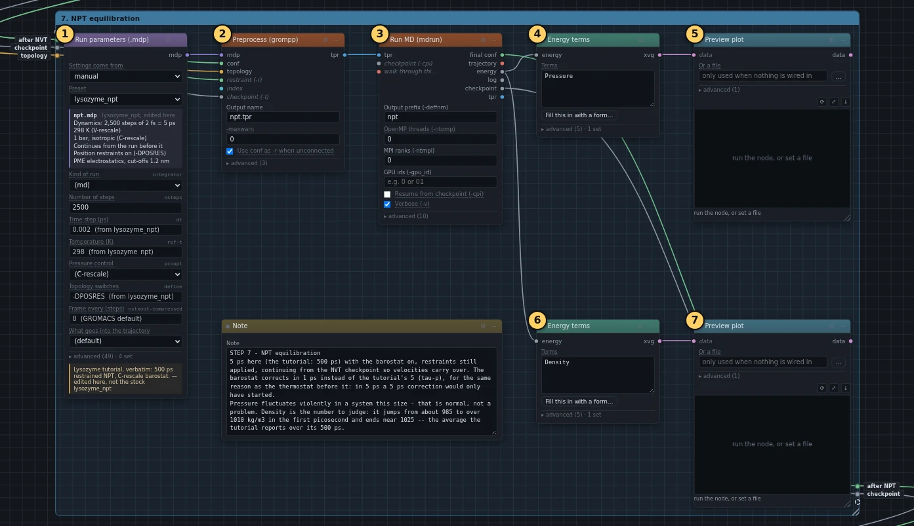
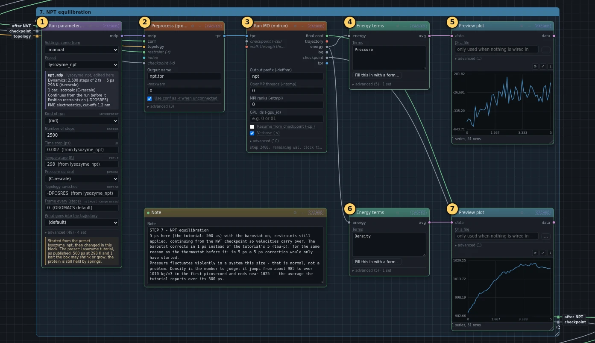
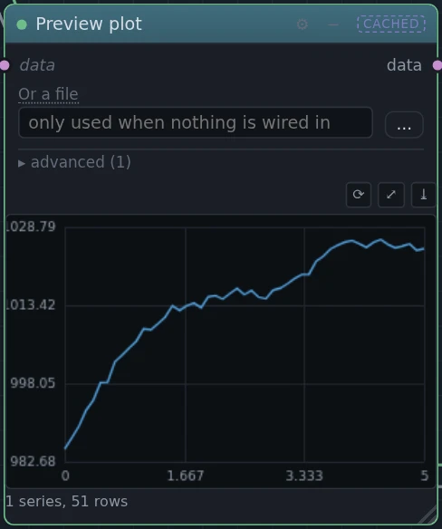
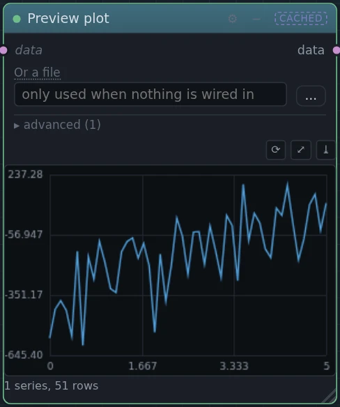

# 7. NPT equilibration

!!! abstract "In this box"
    Carry on from the warm-up, now letting the box shrink or grow until the
    pressure is right, and watch the density settle. **7 blocks.** About
    2 minutes online.

Published tutorial:
[Step Seven: Equilibration, Part 2](http://www.mdtutorials.com/gmx/lysozyme/07_equil2.html).

## What it does, and why

The temperature is right; the pressure is not yet. The box size was chosen
in box 3 by a rule, and the water packed into it by tiles, so the water is
not quite as dense as it should be. *NPT* is short for what stays fixed now:
the Number of atoms, the Pressure and the Temperature. The volume is free.

- A *barostat* keeps the pressure at 1 bar, the pressure of air at sea
  level. When the pressure inside is too high, it makes the box a little
  bigger; when it is too low, a little smaller.
- The run carries on from the end of the NVT run, with the same speeds: no
  new random speeds this time. Those speeds are in the *checkpoint* file
  mdrun wrote at the end of box 6.
- The protein is still held in place by its springs.

The blocks:

- **Run parameters (.mdp)** starts from the preset `lysozyme_npt`, the
  published `npt.mdp`, and changes the same three values as box 6: 5 ps
  instead of 500 ps, the thermostat within 0.1 ps instead of 1 ps, and
  energies every 50 steps. It adds one line, `tau-p = 1.0`, in **Extra mdp
  lines**: the barostat corrects within 1 ps instead of 5, for the same
  reason as the thermostat. In a 5 ps run, a 5 ps correction would only
  just have started.
- **Preprocess (grompp)** takes three wires from box 6's **Run MD
  (mdrun)**: the last positions, as the start and as the springs' reference,
  and the checkpoint, with the speeds.
- **Run MD (mdrun)** runs it.
- Two **Energy terms** blocks take the pressure and the density out of the
  energy file, and a **Preview plot** draws each.

## What you will build

[{ .canvas }](../pictures/lysozyme/box-6.webp)

## Build it

--8<-- "_generated/lysozyme/box-6-build.md"

## Run it, and look

Press **Run**. The run takes almost 2 minutes online.

[{ .canvas }](../pictures/lysozyme/box-6-results.webp)

=== "Density"

    [{ .canvas }](../pictures/lysozyme/plot_dens.webp)

    **This is the graph to judge the box by.** It climbs from 985 kg/m³ at
    the start to about 1022 kg/m³ in the last picosecond: 1021.8 on average
    in our run. The published tutorial reports 1025.3 as its average over
    500 ps. It is higher than pure water, 1000 kg/m³, because of the protein
    and the ions.

=== "Pressure"

    [{ .canvas }](../pictures/lysozyme/plot_press.webp)

    It jumps up and down by hundreds of bar, from −691 to +305 in our run,
    and that is normal. The pressure of a box this small changes from one
    moment to the next by far more than its target of 1 bar. Only its
    average over a long run means anything, and 5 ps is not long: our
    average was −154 bar. Over its 500 ps, the published tutorial's average
    is −3 bar, close to the target.

## Under the hood

The run's whole settings file is under ①.

--8<-- "_generated/lysozyme/box-6-commands.md"
