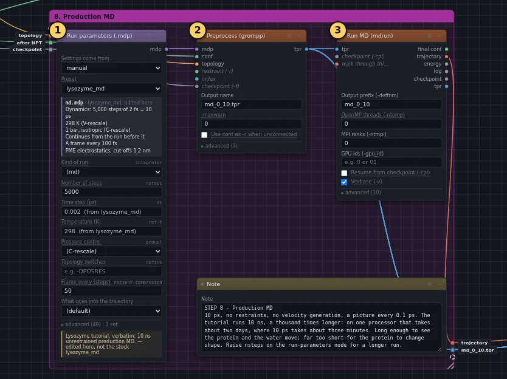
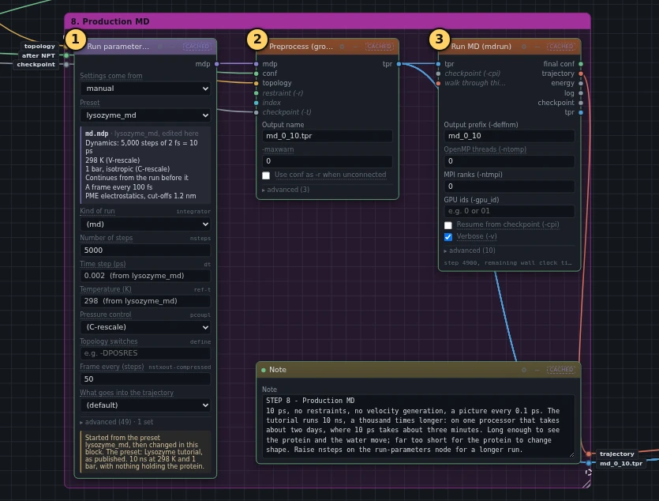

# 8. Production MD

!!! abstract "In this box"
    The run itself: the springs come off, and the protein moves freely in its
    water for 10 ps. **3 blocks.** About 4 minutes online.

Published tutorial:
[Step Eight: Production MD](http://www.mdtutorials.com/gmx/lysozyme/08_MD.html).

## What it does, and why

Temperature and pressure are settled, so the system is ready for the run
that the analysis will look at. It is called *production*, because it
produces the data. Two things change from the warm-ups: nothing holds the
protein in place any more, and mdrun saves a picture of every atom's
position at regular moments, the *trajectory*.

- **Run parameters (.mdp)** starts from the preset `lysozyme_md`, the
  published `md.mdp`, and changes two values. The run is 5,000 steps, 10 ps,
  where the published run is 5,000,000 steps, 10 ns: a thousand times
  longer. And it saves a picture every 50 steps, every 0.1 ps, where the
  published run saves one every 10 ps, which in 10 ps would be only two.
- **Preprocess (grompp)** takes the last positions and the checkpoint of
  box 7's **Run MD (mdrun)**, so the run carries on with the same speeds,
  and builds the run file `md_0_10.tpr`. Its **Use conf as -r when
  unconnected** is switched off: there are no springs, so no reference
  positions, as in the published command.
- **Run MD (mdrun)** runs it, and writes the trajectory that the analysis
  in box 9–10 reads.

The name `md_0_10` stands for "from 0 to 10 ns" in the published tutorial.
The run here is shorter, but it keeps the name, so that every command stays
the same as the published one.

## What you will build

[{ .canvas }](../pictures/lysozyme/box-7.webp)

## Build it

--8<-- "_generated/lysozyme/box-7-build.md"

## Run it, and look

Press **Run**. The run takes almost 4 minutes online. The bottom line of
**Run MD (mdrun)** counts the steps and says how long is left.

[{ .canvas }](../pictures/lysozyme/box-7-results.webp)

This box draws nothing. Its trajectory is what box 9–10 looks at.

!!! question "Why not run the full 10 ns?"
    Online, mdrun simulated about 4 ns a day on one processor. At that pace
    the published 10 ns would take about 2½ days, where 10 ps takes
    4 minutes. Ten picoseconds is enough to see every step of the work and
    every analysis run, but far too short for the protein to do anything
    interesting: it has barely started to move. A graphics card makes a
    great difference: the published tutorial reports about 196 ns a day on
    one, which brings its 10 ns down to just over an hour. To run longer,
    raise **Number of steps** on ①.

## Under the hood

The run's whole settings file is under ①.

--8<-- "_generated/lysozyme/box-7-commands.md"
