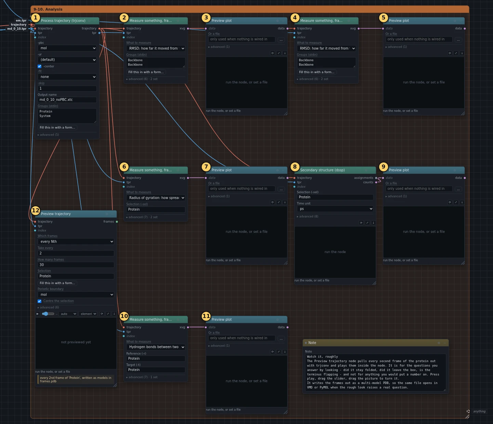
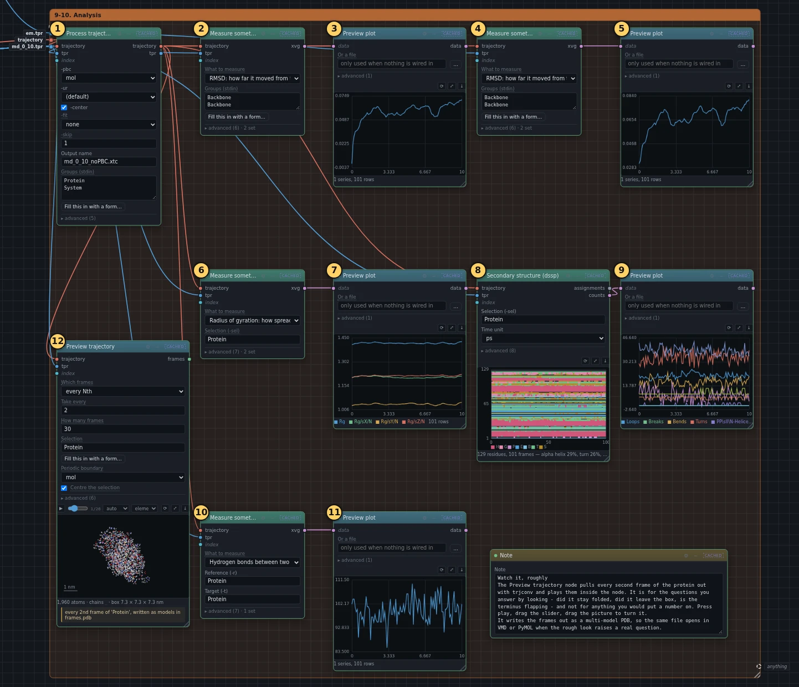
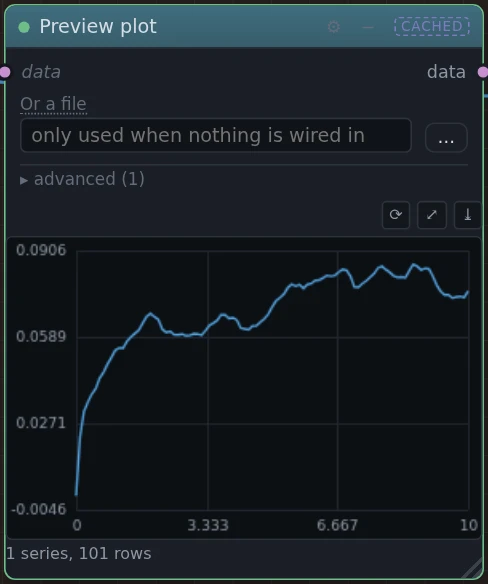
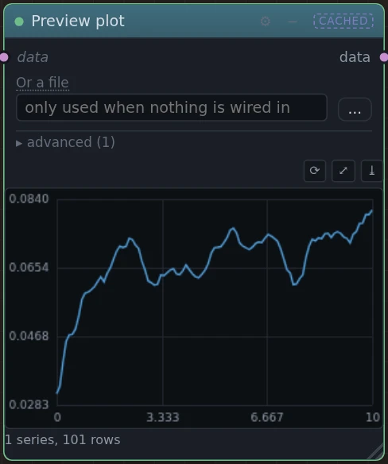
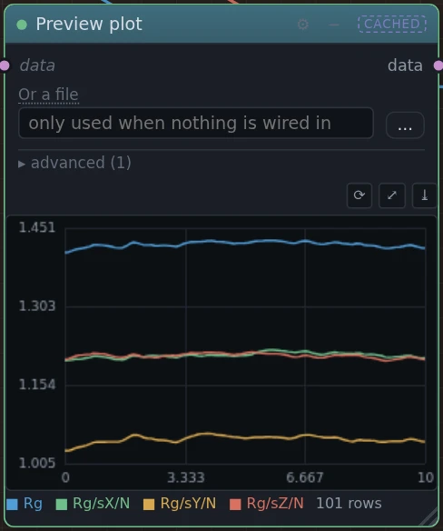
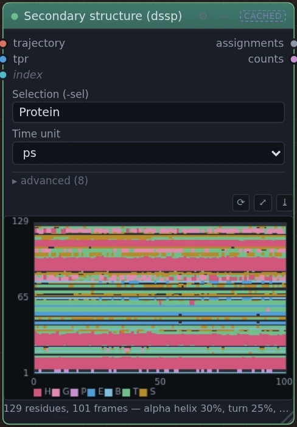
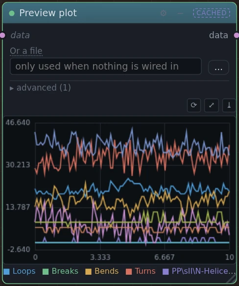
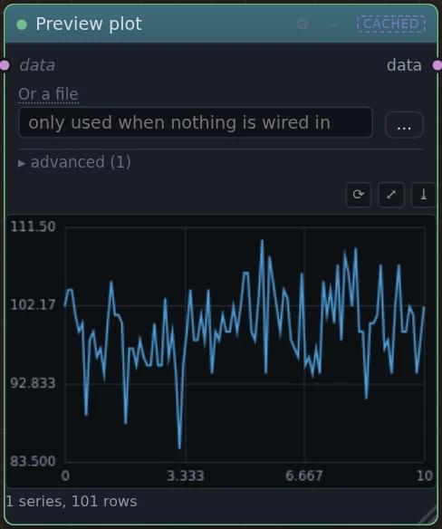
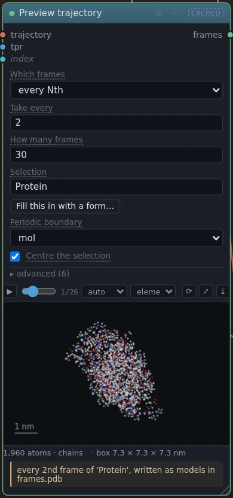

# 9–10. Analysis

!!! abstract "In this box"
    Look at what the protein did in the production run: how far it moved,
    whether it stayed compact, whether its helices held, how many hydrogen
    bonds hold it together, and a movie of it. **12 blocks.** About
    20 seconds online.

Published tutorial:
[Step Nine: Analysis](http://www.mdtutorials.com/gmx/lysozyme/09_analysis.html),
on two pages ([the second](http://www.mdtutorials.com/gmx/lysozyme/10_analysis2.html)).

## What it does, and why

Every block in this box reads the trajectory, the pictures of every atom
that the production run saved every 0.1 ps. Each measuring block is
followed by a **Preview plot** that draws its answer inside the canvas, so
you need not go looking for a file.

- **Process trajectory (trjconv)** comes first, and everything else reads
  its output. The box repeats in every direction, and GROMACS keeps every
  atom inside it: a protein near one side can show up cut in two, part of it
  poking in from the opposite side. trjconv puts each molecule back together
  (`-pbc mol`) and moves the protein to the middle of the box in every
  picture (`-center`). Its **-ur** is set to its empty choice, `(default)`,
  so that the command is the published one.
- Two **Measure something, frame by frame** blocks measure the *RMSD*, the
  root-mean-square deviation: how far, on average, the backbone atoms are
  from where they were in a reference structure, after the protein is
  turned and moved to match it as well as it can. ② compares with the start
  of the production run, `md_0_10.tpr`. ④ compares with the crystal
  structure: `em.tpr` from box 5, which still holds the positions from
  before the minimisation.
- ⑥ measures the *radius of gyration*: roughly, how far the atoms are from
  the protein's middle, on average. A folded protein keeps it steady; one
  that unfolds spreads out, and it grows.
- **Secondary structure (dssp)** decides, for every amino acid in every
  picture, which shape the chain makes there: a helix, a strand of a sheet,
  a turn, or none. It draws the answer as a map, and also counts each shape
  per picture for ⑨ to draw.
- ⑩ counts the *hydrogen bonds* inside the protein: an H atom bonded to an
  N or O, held close to another N or O. They hold the helices and sheets
  together.
- **Preview trajectory** makes a movie of the protein, from every second
  picture, played inside the block.

The measuring blocks show times in picoseconds (**Time unit** `ps`), where
the published commands use nanoseconds: in a 10 ps run, every time would
read 0.00 something.

## What you will build

[{ .canvas }](../pictures/lysozyme/box-8.webp)

This box is big. Click the picture to see it full size.

## Build it

④ is ② again, with another output name and another reference. The
quickest way to it is to copy ②: click it, press ++ctrl+d++ (on a Mac,
++cmd+d++), change the **Output name**, and draw the wires the list gives.
Building it from the list works just as well.

--8<-- "_generated/lysozyme/box-8-build.md"

## Run it, and look

Press **Run**. The analysis takes about 20 seconds online.

[{ .canvas }](../pictures/lysozyme/box-8-results.webp)

=== "RMSD"

    [{ .canvas }](../pictures/lysozyme/plot_rms.webp)

    From the start of the run: it rises from 0 to 0.07 nm in our run, less
    than the width of one atom. The protein shivers and shifts a little, as
    it should, and that is all.

=== "RMSD from the crystal"

    [{ .canvas }](../pictures/lysozyme/plot_rms_xtal.webp)

    From the crystal structure: it starts at 0.03 nm, not 0, because the
    minimisation and the warm-ups already moved the protein a little, and
    rises to 0.08 nm. The published tutorial finds about 0.09 nm over its
    10 ns, for both RMSD curves. RMSD only says how far the protein has
    moved. It does not say that a run is long enough.

=== "Radius of gyration"

    [{ .canvas }](../pictures/lysozyme/plot_rg.webp)

    The top line, `Rg`, is the one to read: flat near 1.42 nm (from 1.41 to
    1.43 in our run). The published tutorial finds 1.41 nm over its 10 ns.
    The protein stays folded. The three lower lines are the same measure
    around each of the three axes. Their names are written in codes meant
    for another plotting program: `Rg/sX/N` stands for Rg with a small X
    below it, the radius around the X axis.

=== "Secondary structure"

    [{ .canvas }](../pictures/lysozyme/dssp_map.webp)

    Amino acids up the side, from 1 to 129, and pictures along the bottom,
    from 0 to 100, one every 0.1 ps. Each colour is a shape: **H** an
    α-helix, **G** a tighter 3₁₀-helix, **P** a stretched-out polyproline
    helix, **E** a strand of a sheet, **B** a single bridge between two
    strands, **T** a turn, **S** a bend. Dark is no particular shape.
    Read bands, not single spots: a band that runs the whole width is a
    piece of structure that held for the whole run.

    The line under the map gives the averages over the run; ours were:

    | shape | share of the amino acids |
    | --- | --- |
    | α-helix (H) | 29.2% |
    | 3₁₀-helix (G) | 5.7% |
    | polyproline helix (P) | 0.3% |
    | strand (E) and bridge (B) | 6.5% and 4.3% |
    | turn (T) and bend (S) | 25.7% and 12.5% |
    | none | 15.9% |

    In our run the four big helices sit at amino acids 5–14, 25–35, 89–99
    and 109–113, and all four hold in every one of the 101 pictures. Two
    short ones, at 80–83 and 121–124, come and go. The small sheet is three
    short strands, at 43–45, 51–53 and 58–59.

=== "Shapes per picture"

    [{ .canvas }](../pictures/lysozyme/plot_dssp.webp)

    The same map, counted picture by picture. The lines jump around from
    one picture to the next, but none of them falls away: the helices are
    all still there at the end. A line sloping steadily down would be a
    structure coming apart.

=== "Hydrogen bonds"

    [{ .canvas }](../pictures/lysozyme/plot_hb.webp)

    Between 85 and 110 at any moment, 99 on average in our run. The
    published tutorial counts them in parts instead: about 55 between
    backbone atoms, and about 20 between side chains. Our count is all of
    them, including the ones between a backbone atom and a side chain, so
    it is bigger than the two together.

=== "Movie"

    [{ .canvas }](../pictures/lysozyme/watch.webp)

    Press ▶ to play it, drag the slider to go to a moment, and drag the
    picture to turn it. It answers questions you answer by looking: did it
    stay folded, does the end of the chain flap about. The movie is also
    saved as `frames.pdb`, which other viewers such as VMD or PyMOL open.

The numbers along the side of the graphs are too long for them, so their
left end is cut off. The values are in the text here.

## Under the hood

--8<-- "_generated/lysozyme/box-8-commands.md"
