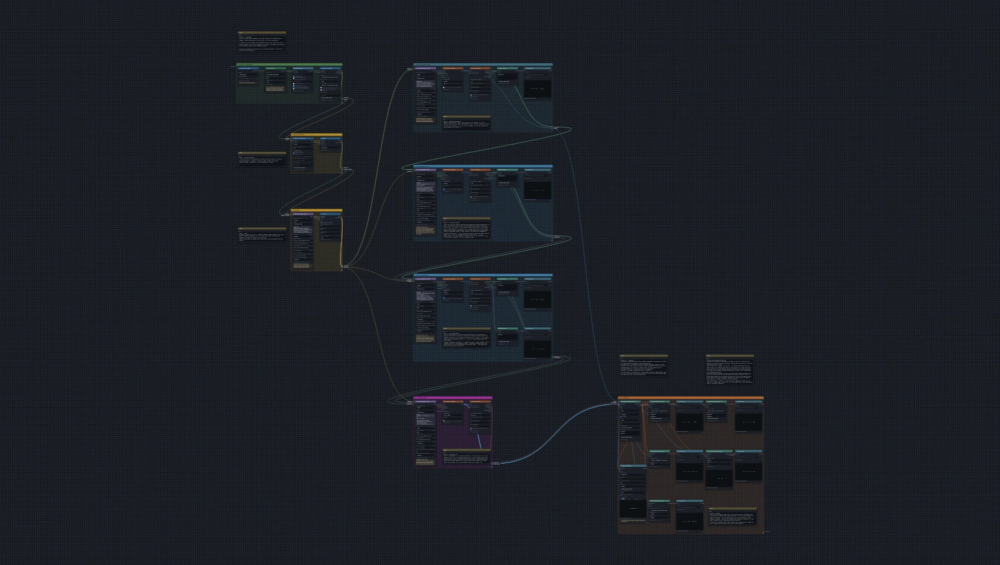

# Lysozyme in water

Lysozyme is a small protein, 129 amino acids long, found in egg white and in
tears. It protects them by breaking open the walls of bacteria. This tutorial
puts one lysozyme molecule in a box of water and takes it through every step
of a standard simulation: describe it for GROMACS, surround it with water,
cancel its electric charge, remove bad contacts, warm it up, let the box
settle, run it, and look at what it did.

It follows Justin A. Lemkul's tutorial
[Lysozyme in Water](http://www.mdtutorials.com/gmx/lysozyme/) step by step,
with the same commands and the same settings files. The one big difference:
every run is cut short, so the whole tutorial takes minutes instead of days.

[{ .canvas }](../pictures/lysozyme/whole.webp)

## The boxes

The boxes are numbered after the steps of the published tutorial, so that
each page here sits next to its page there. Its step 2 only reads a file, so
it shares a box with step 1.

| box | what it does | blocks |
| --- | --- | --- |
| [1–2. Topology](1-topology.md) | downloads the protein and the force field, removes the crystal water, and writes the description GROMACS needs | 4 |
| [3. Box and solvent](3-box.md) | puts the protein in a box and fills the box with water | 2 |
| [4. Add ions](4-ions.md) | swaps 8 water molecules for chloride ions, so the whole box has no net charge | 2 |
| [5. Energy minimisation](5-minimisation.md) | moves the atoms out of each other's way before anything is allowed to move freely | 5 |
| [6. NVT equilibration](6-nvt.md) | warms the water to 298 K while the protein is held in place | 5 |
| [7. NPT equilibration](7-npt.md) | lets the box shrink or grow until the pressure is right | 7 |
| [8. Production MD](8-production.md) | the run itself, with the protein free | 3 |
| [9–10. Analysis](9-analysis.md) | how far the protein moved, how compact it stayed, its helices and hydrogen bonds, and a movie | 12 |

## What is shortened, and why

A lesson has a quarter of an hour for a run, and an online copy has one
processor. The published runs are made for a workstation and an afternoon,
so three of them are cut down:

| run | published | here |
| --- | --- | --- |
| NVT equilibration (temperature) | 100 ps | 5 ps |
| NPT equilibration (pressure) | 500 ps | 5 ps |
| production | 10 ns | 10 ps |

A picosecond (ps) is a millionth of a millionth of a second; a nanosecond
(ns) is a thousand picoseconds.

Two settings change with the lengths. The *thermostat*, the part of the run
that keeps the temperature at its target, corrects within 0.1 ps instead of
1 ps. The *barostat*, which does the same for the pressure, corrects within
1 ps instead of 5. The published values are made for the long runs: in only
5 ps they would not finish their job.

The short runs also save their energies and pictures more often, every
0.1 ps. The published runs save every 1, 5 or 10 ps, which in these short
runs would leave between two and six points to draw a curve through.

Each page says where its box differs. To make a run longer, raise **Number
of steps** on its **Run parameters (.mdp)** block.

Everything else follows the published tutorial: the protein, the water, the
box, the ions, the temperature, the pressure, and every other setting of
every run. The one exception is in the analysis: the hydrogen bonds are
counted over the whole protein, where the published tutorial counts them in
parts.

!!! note "A newer force field release"
    The tutorial downloads the July 2022 release of the CHARMM36 force field,
    the rules for how the atoms push and pull on each other. The published
    tutorial has since moved to a newer release. Expect small differences in
    the numbers.

## How long it takes

On mybinder.org, with one processor, the whole tutorial takes about
9 minutes from **Run** to the last block. The production run takes about
4 minutes of it, each of the two warm-up runs about 2, and the minimisation
under 1. Everything else takes seconds.

At that speed, the published 10 ns production run alone would take about
2½ days.

## What you need to know first

The pages say in a few sentences what each box is for. The published
tutorial explains the science properly, and each page links to its step
there: read it alongside. If the mouse and keyboard parts are new, read
[Before you start](../basics.md) first.

## Credit

The steps and settings files are Justin A. Lemkul's. The explanations on
these pages are our own. Work that uses the tutorial should cite it:

> Lemkul, J. A. (2018) From Proteins to Perturbed Hamiltonians: A Suite of
> Tutorials for the GROMACS-2018 Molecular Simulation Package. *Living J.
> Comput. Mol. Sci.* 1(1), 5068.
> [doi:10.33011/livecoms.1.1.5068](https://doi.org/10.33011/livecoms.1.1.5068)
